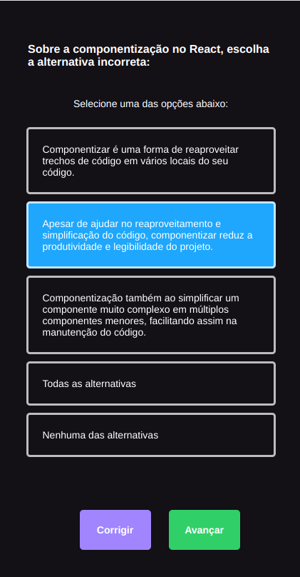

<h1>App Mobile</h1>

A simple mobile app for create questions.

<h2>Stack</h2>
<ul>
  <li>React Native</li>
  <li>Typescript</li>
  <li>React Navigation</li>
  <li>AsyncStorage</li>
  <li>Expo</li>
</ul>

<h2>Next Features</h2>
<ul>
  <li>Icon for app and loading</li>
  <li>Database</li>
</ul>

<figure>
    
    
    
    
</figure>

